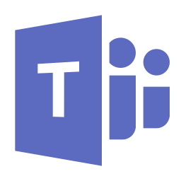

# Teams Multiple Instances 🚀



Um aplicativo Electron que permite executar múltiplas instâncias do Microsoft Teams simultaneamente no Linux.

## 🌟 Características

- Executa até 3 instâncias do Microsoft Teams simultaneamente
- Interface nativa e integrada com o sistema
- Suporte a notificações do sistema
- Menu personalizado para configuração de instâncias
- Persistência de sessão para cada instância

## 📋 Pré-requisitos

Antes de começar, você precisa ter instalado em sua máquina:

- Node.js (versão 14.x ou superior)
- npm (normalmente vem com Node.js)
- Git

## 🚀 Instalação

1. Clone o repositório:
```bash
git clone https://github.com/GabeHenrique/teams-multiple-instances.git
